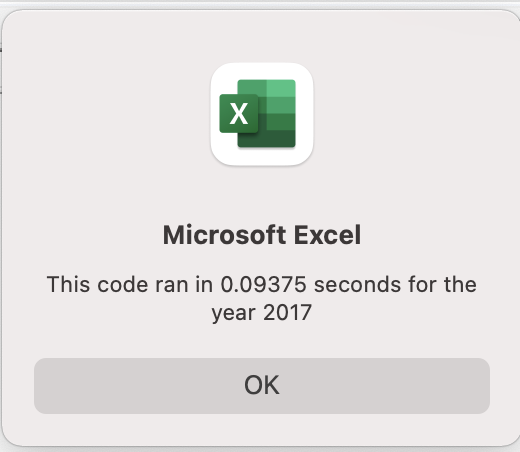
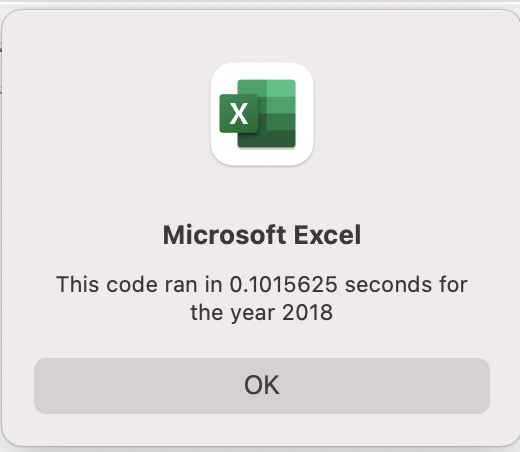

# Stock Analysis
 
## Overview of Project

The following projects represent the analysis of the stock market for 12 stocks for the period 2017 – 2018. We have been given a preliminary VBA code to run the stock performance analysis. To perform the analysis in a more efficient way we refactored the preliminary code.

## Results
* Based on our analysis, we noted that in 2017, 11 stocks out of 12 showed a positive return, whereas in 2018 only two stocks had a positive return. Such a significant change in the companies’ performance was most likely related to the overall performance of the market due to the financial crisis that started in 2018.
* In relation to the refactoring aspect of the VBA code, we noted that using a new approach we were able to run a script more than 3 times faster. With an original code, it took 0.3 seconds to run a script as shown below versus 0.9 seconds with a refactored code. 

## Summary
We summarized below the advatages and disadvantages of refactoring in general and for VBA script.

Advantages:
* Faster results
* Run for a bigger population

Disadvantages:
* Code can get over-complicated
* Hard to read a code and fix a code
